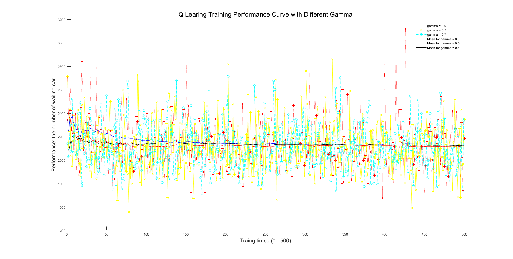

# Traffic Control with Q-learning

_Note: please install the plugin for chrome [Tex All the things](https://chrome.google.com/webstore/detail/tex-all-the-things/cbimabofgmfdkicghcadidpemeenbffn)_

## Introduction

Traffic congestion is one of the most serious problems in big cities and it has made people’s lives more difficult. Thirty years ago, there were fewer cars on the street and people did not suffer from traffic. Today, however, streets are full of cars, buses and trucks. The delay of traffic lights has become a way to reduce traffic congestion. However, the hand control may spend a great number of human resources on it and it is difficult to have policies for each crossroads. Then, intelligence traffic light control system stands out and become a significant method to alleviate traffic jams. It will use a learning system to control the delay of each light.

To start, traffic is flowing only one way on two intersecting roads
controlled by a set of traffic lights. Cars enter the road some way from the
intersection at random intervals, ie when time%(rnd.nextInt(10)+5)==0. Time
is just a clock counter that is incremented at each step. 

The simulator moves the cars one space along the road at each time-step. The
road length can be about 100 units, one unit of road holds one car. The cars
only travel in only one direction and are removed from the road when they
reach the boundary of the simulated region. If a car is stopped by a red
light, it cannot move forward. The cars cannot occupy the same space. Other
cars therefore queue behind stopped cars.

A controller can change the lights, but only after waiting at least three
time-steps since the last change.

## Implementation

The intelligence traffic light control system edits by python 3.6. There is a four-way crossroad in the middle of the shown picture.


For each crossing, there are two directions. The car will allow crossing the crossroad in two methods: the horizontal method and the vertical method. The car is controlled by the traffic lights and the lights have two colours: red and green. In order to simulate real lights, the opposite light will have the same colour as well as the adjoining light will have a different colour. For example, the northern light is red, the southern light should be read and others should be green. Therefore, the car will only go with one method each time.

### Simulator (front end)

For UI design, this project are implemented with Tkinter that is a popular package on python3 in the traffic_sim.py.

The front end is developed as OpenAI-like framework which contain:

- **`restart`**: restart the game
- **`render`**: update the game screen
- **`step`**: the action will be deployed in the step function.


### Q-learning (back end)
Q-learning is a reinforcement learning technique used in machine learning. The technique does not require ro biuld up a model of the environment in advance. Q-learning can handle problems with stochastic transitions and rewards without requiring adaptations but hyperparameter.

For any finite Markov decision process (FMDP), Q-learning eventually finds an optimal policy in the sense that the expected value of the total reward return over all successive steps, starting from the current state, is the maximum achievable. Q-learning can identify an optimal action-selection policy for any given FMDP.

The Bellman update formula:
$$
    Q(s, a) = Q(s, a) + \eta(r + \gamma max_aQ(s', a') - Q(s, a))
$$

where 

- $s$ is the current state

- $s'$ is the future state reached by performing action $a$ in the current state $s$ 

- $Q(s, a)$ is the value of taking action $a$ in the current state $s$

- $maxQ(s', a')$ is the maximum of the values of taking all possible actions $a'$ in the future state $s'$,

- $\eta$ is the learning rate, 

- $\gamma$ is the discount factor

- $r$ is the reward. 

In this project

**State:**

- closest car position from intersection for road 1 (0-8, 9 if no cars) X
- closest car position from intersection for road 2 (0-8, 9 if no cars X
- light setting (ie 0-green, 1 red for one of the roads) X
- light delay (0-3)

Two actions: 

- decide to switch or not.

Reward:
- -1.0 if a car is stopped at a red light on either road, zero
otherwise.

the psudocode of this project:

> Input:
> 
> Environment $E$; Action space $A$; Initial state $s_o$; Reward $\gamma$;
> 
> Process:
> 
> $Q(s, a)=0, \pi(s,a)=\frac{1}{\mid A(s) \mid}$
> 
> $s=s_o, a=\pi(s);$
> 
> $for\ t=1,2,…,do:$
> 
> $\qquad a'=\pi(s')$
> 
> $\qquad Q(s,a) = Q(s,a) + \eta (r+\gamma Q(s', a')-Q(s, a))$
> 
> $\qquad \pi(s)=argmax_a' Q(x, a' )$
> 
> $\qquad x=x’, a=a’$
> 
> $end$
> 
> Output: strategy $\pi$


## Result Analysis

we plot the analysis figure with matlab.

### Q-learning vs Hand control


From this picture, it can be observed that hand-control model is inefficient. When the light switchover time is 10 time-steps, the number of waiting cars is high and fluctuate between about 600 and 900. And then, when it changes every 3 time-step (The minimum time allowed to change the light), the traffic situation is become better, the cars which is bumper-to-bumper is decreased between 400 and 600. Obviously, sometimes even there are no cars want to cross the road, the car on the other side can’t move too. Therefore, it wastes a lot of time. However, the time-step is immobile in hand-control model, so it may not suitable for most of situations.

Compared with the hand-control model, the number of waiting cars has decreased dramatically when it turns to Q-Learning. Because of the study of the Q-Learning, it can learn to control the traffic light more and more efficiently. What is more, it also can adjust the time-step dynamically so that it can make the light change frequency more appropriate to suit the changeable traffic situation.


### Different traffic density


As we can see from the picture that when the create rate of the cars is 0.1, the result of waiting cars only have less than 500. When the rate is increases to 0.2 and 0.3, the number of waiting cars increase to 1000 and 2300. It is believed that the number of waiting cars is proportionate to the increased create rate of cars. This information has shown bad news for us which is that although the intelligence traffic light control system may useful to alleviate the traffic jams, it still have the limitation. If the number of cars in the system increases to a huge number, no matter how intelligent the system is, it still cannot work and the delay will be unavoidable.

### $\epsilon$: greedy exploration


From the picture, we can see that after 100 times training the data become stable. The lower Epsilon has the lowest number of waiting cars. When it equal to 0 that means the learning will not start and the bad result will appear more times. From the picture, we may need to get the lower Epsilon to test more times. From our data, the best greedy exploration is 0.01.

### $\eta$: learning rate


From the picture we can see, both the learning rate 0.5 and 0.7 have a bad result than 0.1.

When the learning rate is equal to 0 means that it cannot learn anything as well as 1 means that it will considers recent information more. Both them will not deliver a best result. Due to the limited running time, there are only few results can be shown. Therefore, we cannot see 0.1 is the best learning rate but at least it is better than 0, 0.5, 0.7 and 1. We may have a surmise that it is the best learning rate for our system.


### $\gamma$: discount factor



The discount factor gamma is a significant element and it uses to control the future rewards. When it equal to 0 means that it will only consider the current rewards. Otherwise, both 0 and 1 discount factor cannot deliver a good result of waiting cars. To compare the shown result from the picture, we can see that when discount factor gamma is equal to 0.5 has the lowest number of waiting cars. Due to the limited data, we only can say that the 0.5 is the best discount factor in these tests. 

## Dependencies and Installation

- Dependencies
  - matplotlib>=2.2.2
  - numpy>=1.14.2
  - pandas>=0.23.0
  - scipy>=1.0.0

- Installation
  - For windows:
    ```powershell
    > python -m pip install --user -U pip
    > pip install --user -r require_for_window.txt
    ```
  - For Mac:
    ```shell
    $ pip3 install --user -U pip
    $ pip3 install --user -r require.txt
    ```

## Reference

- [1] Steingrover, M., Schouten, R., Peelen, S., Nijhuis, E., Bakker, B. 2005, _Reinforcement learning of traffic light controllers adapting to traffic congestion_, BNAIC.

- [2] Nguyen, T. T., & Armitage, G. (2008). _A survey of techniques for internet traffic classification using machine learning. IEEE Communications Surveys & Tutorials_, 10(4), 56-76.
